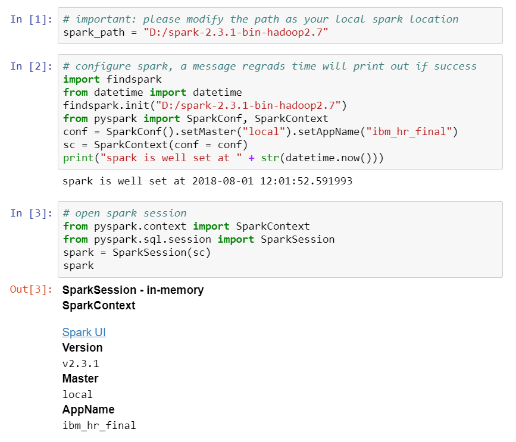

# Installation of Jupyter Notebook with Spark on Windows

## Prerequisite
* Anaconda in your local PC, [download](https://www.anaconda.com/download/)
* Spark in your local directory, [download](https://spark.apache.org/downloads.html)
* Java (remember to set the environment variable)
* Access to Windows [Powershell](https://docs.microsoft.com/en-us/powershell/scripting/getting-started/getting-started-with-windows-powershell?view=powershell-6)
  * press `win` + `R`
  * type **powershell** for quick access

## Usage
* jupyter notebook: run following command will initiate a new page in your web brower
  * remember to use `cd` command to navigate to your desired directory to store your notebooks
```shell
jupyter notebook
```
  * if you would like to use python2 kernels, type this and you are free to switch kernel
```shell
jupyter lab
```
* spark: extracted to a local directory and remember the path
  * you can use **7-zip** for extraction, [download](https://www.7-zip.org/)

## Step 1: check whether spark works fine
* open powershell and navigate to spark directory (for me, that is `D:\spark-2.3.1-bin-hadoop2.7`)
```console
PS D:\spark-2.3.1-bin-hadoop2.7>
```
* type this to start pyspark (for test)
```shell
bin/pyspark
```
* try to type some python commands with spark
```python
# should return 2
1 + 1
# should echo with hello
print("hello")
# should return a SparkContext message
sc
```
* here is the log on in my powershell
```console
PS D:\spark-2.3.1-bin-hadoop2.7> bin/pyspark
Python 3.6.3 |Anaconda custom (64-bit)| (default, Oct 15 2017, 03:27:45) [MSC v.1900 64 bit (AMD64)] on win32
Type "help", "copyright", "credits" or "license" for more information.
2018-01-01 00:00:00 ERROR Shell:397 - Failed to locate the winutils binary in the hadoop binary path
java.io.IOException: Could not locate executable null\bin\winutils.exe in the Hadoop binaries.
        at org.apache.hadoop.util.Shell.getQualifiedBinPath(Shell.java:379)
        at org.apache.hadoop.util.Shell.getWinUtilsPath(Shell.java:394)
        at org.apache.hadoop.util.Shell.<clinit>(Shell.java:387)
        at org.apache.hadoop.util.StringUtils.<clinit>(StringUtils.java:80)
        at org.apache.hadoop.security.SecurityUtil.getAuthenticationMethod(SecurityUtil.java:611)
        at org.apache.hadoop.security.UserGroupInformation.initialize(UserGroupInformation.java:273)
        at org.apache.hadoop.security.UserGroupInformation.ensureInitialized(UserGroupInformation.java:261)
        at org.apache.hadoop.security.UserGroupInformation.loginUserFromSubject(UserGroupInformation.java:791)
        at org.apache.hadoop.security.UserGroupInformation.getLoginUser(UserGroupInformation.java:761)
        at org.apache.hadoop.security.UserGroupInformation.getCurrentUser(UserGroupInformation.java:634)
        at org.apache.spark.util.Utils$$anonfun$getCurrentUserName$1.apply(Utils.scala:2467)
        at org.apache.spark.util.Utils$$anonfun$getCurrentUserName$1.apply(Utils.scala:2467)
        at scala.Option.getOrElse(Option.scala:121)
        at org.apache.spark.util.Utils$.getCurrentUserName(Utils.scala:2467)
        at org.apache.spark.SecurityManager.<init>(SecurityManager.scala:220)
        at org.apache.spark.deploy.SparkSubmit$.secMgr$lzycompute$1(SparkSubmit.scala:408)
        at org.apache.spark.deploy.SparkSubmit$.org$apache$spark$deploy$SparkSubmit$$secMgr$1(SparkSubmit.scala:408)
        at org.apache.spark.deploy.SparkSubmit$$anonfun$doPrepareSubmitEnvironment$7.apply(SparkSubmit.scala:416)
        at org.apache.spark.deploy.SparkSubmit$$anonfun$doPrepareSubmitEnvironment$7.apply(SparkSubmit.scala:416)
        at scala.Option.map(Option.scala:146)
        at org.apache.spark.deploy.SparkSubmit$.doPrepareSubmitEnvironment(SparkSubmit.scala:415)
        at org.apache.spark.deploy.SparkSubmit$.prepareSubmitEnvironment(SparkSubmit.scala:250)
        at org.apache.spark.deploy.SparkSubmit$.submit(SparkSubmit.scala:171)
        at org.apache.spark.deploy.SparkSubmit$.main(SparkSubmit.scala:137)
        at org.apache.spark.deploy.SparkSubmit.main(SparkSubmit.scala)
2018-08-02 10:53:16 WARN  NativeCodeLoader:62 - Unable to load native-hadoop library for your platform... using builtin-java classes where applicable
Setting default log level to "WARN".
To adjust logging level use sc.setLogLevel(newLevel). For SparkR, use setLogLevel(newLevel).
Welcome to
      ____              __
     / __/__  ___ _____/ /__
    _\ \/ _ \/ _ `/ __/  '_/
   /__ / .__/\_,_/_/ /_/\_\   version 2.3.1
      /_/

Using Python version 3.6.3 (default, Oct 15 2017 03:27:45)
SparkSession available as 'spark'.
>>> 1 + 1
2
>>> print("hello")
hello
>>> sc
<SparkContext master=local[*] appName=PySparkShell>
>>>
```
## Step 2: install package `findspark` to connect jupyter notebook with spark
* open your Windows powershell and install findspark with this command:
```shell
pip install findspark
```
* create a jupyter notebook and copy the following command in your code chunk:
```python
# important: please modify the path as your local spark location 
spark_path = "D:/spark-2.3.1-bin-hadoop2.7"
# configure spark, a message regrads current time will print out if success
import findspark
from datetime import datetime
findspark.init("D:/spark-2.3.1-bin-hadoop2.7")
from pyspark import SparkConf, SparkContext
conf = SparkConf().setMaster("local").setAppName("my_app")
sc = SparkContext(conf = conf)
print("spark is well set at " + str(datetime.now()))
```
## Step 3: open spark session and code with pyspark in jupyter notebook
* copy this code to open spark session:
```python
# open spark session, a spark message will be printed out if success
from pyspark.context import SparkContext
from pyspark.sql.session import SparkSession
spark = SparkSession(sc)
spark
```
* hereby you can code with spark in following chunks.
  * access local files and do a count:
```python
# load dataset
df = spark.read.csv("path/to/dataset.csv", header = True, mode = "DROPMALFORMED")
df.count()
```
* here is a screenshot of my work with spark in jupyter notebook for your reference:


## Reference
* Day accessed: 2018/08/02 (in `yyyy/mm/dd` format)
* [General guide](https://changhsinlee.com/install-pyspark-windows-jupyter/)
* [local spark with Hadoop](http://www.eaiesb.com/blogs/?tag=install-spark-locally-on-windows)
* [install anaconda on Windows](https://medium.com/@GalarnykMichael/install-python-on-windows-anaconda-c63c7c3d1444)
* [install java on Windows](https://docs.oracle.com/javase/10/install/installation-jdk-and-jre-microsoft-windows-platforms.htm#JSJIG-GUID-A7E27B90-A28D-4237-9383-A58B416071CA)